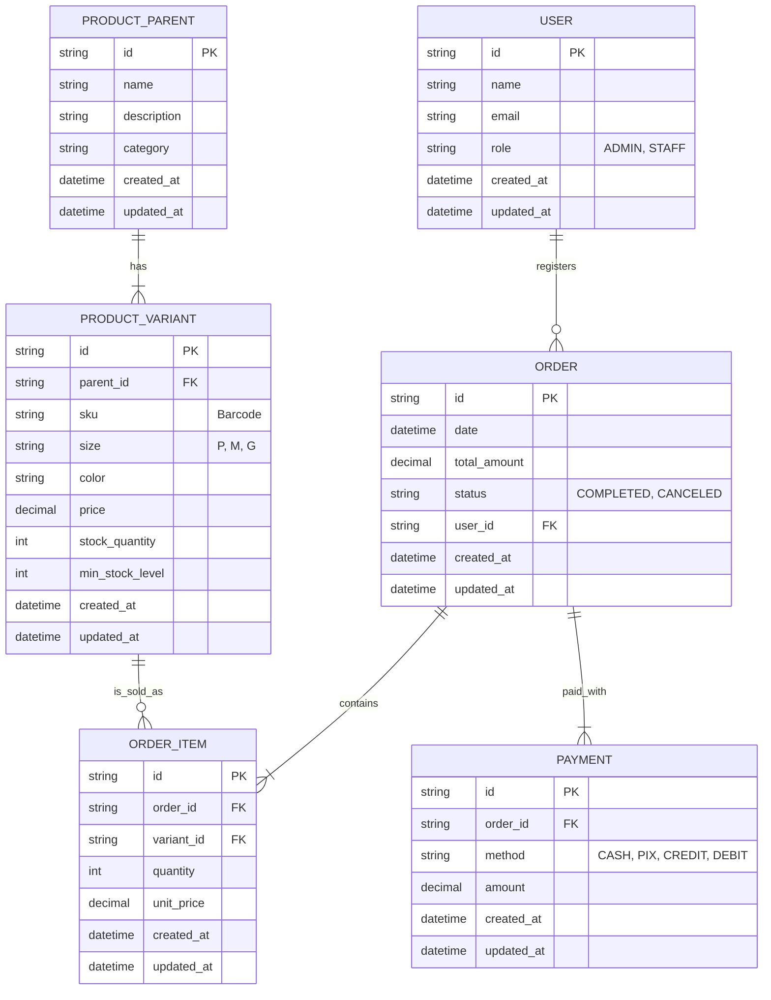
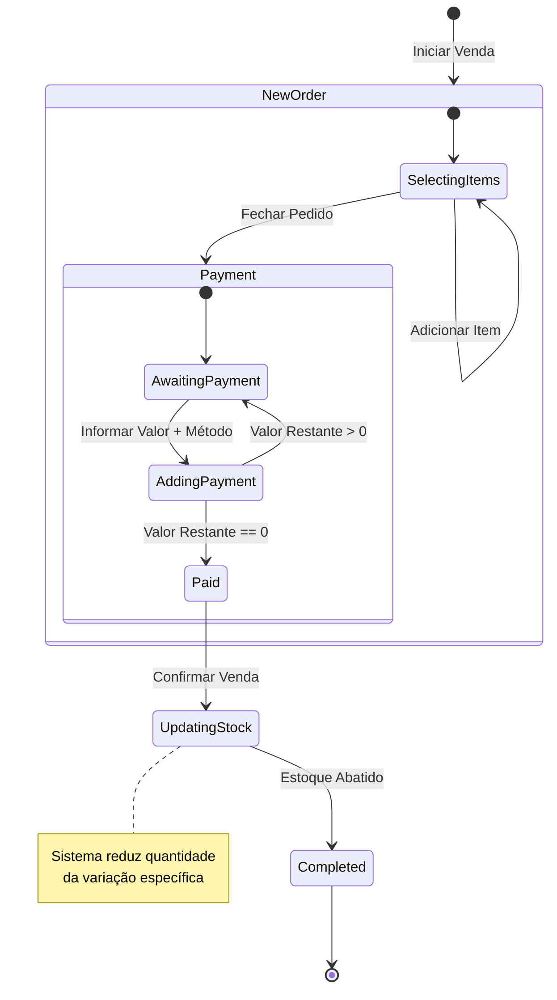

# 📋 Documento de Requisitos de Software: SellTrack PDV

**Versão:** 1.0  
**Data:** 20/12/2025  
**Status:** Validado para Desenvolvimento

---

## 1. 🚩 Problema e Justificativa

### **Problema Identificado**

A operação atual da loja sofre com **processos manuais excessivos e inseguros**.

1.  **Tempo excessivo em inventários:** A contagem manual de peças antes de fechar a loja é desgastante.
2.  **Insegurança no registro de vendas:** O uso de caderno/planilha gera erros, esquecimentos e falta de confiabilidade nos dados.

### **Justificativa**

O projeto é prioritário devido a dois fatores críticos:

1.  **Qualidade de Vida:** A rotina manual está insustentável e consumindo tempo pessoal da proprietária.
2.  **Impacto Financeiro:** Há suspeita de "furos" no caixa e perda de estoque causados pela falta de controle rigoroso.

---

## 2. 🎯 Objetivos do Projeto

| Objetivo                  | Métrica de Sucesso                                                     |
| :------------------------ | :--------------------------------------------------------------------- |
| **Agilidade Operacional** | Reduzir o fechamento de caixa/inventário de ~1h para **5-10 minutos**. |
| **Digitalização Total**   | Eliminar **100% dos registros em papel** (fim do caderno).             |
| **Confiabilidade**        | Reduzir divergências de estoque para próximo de zero.                  |

---

## 3. � Escopo do MVP (Fase 1)

### **✅ O que ESTÁ Incluído**

- **Plataforma Web:** Acesso via navegador no notebook da loja.
- **Gestão de Produtos:** Cadastro hierárquico (Pai/Filho) com Variações de Tamanho e Cor.
- **Ponto de Venda (PDV):** Registro rápido de vendas.
- **Controle Financeiro:** Suporte a pagamentos mistos (Split Payment).
- **Segurança de Dados:** Backup automático na nuvem e Exportação para Excel.
- **Gestão de Estoque:** Baixa automática e alertas de estoque mínimo.

### **❌ O que ESTÁ Excluído (Furo Escopo)**

- Emissão de Nota Fiscal (NFC-e / NF-e).
- Modo Offline (dependência de internet estável).
- App Mobile Nativo.
- Integração direta (TEF) com maquininha de cartão.
- Trocas Automatizadas (serão feitas manualmente via ajuste de estoque).

---

## 4. ⚙️ Requisitos Funcionais

### **RF01 - Gestão de Produtos (Hierárquico)**

- O sistema deve permitir cadastrar um **Produto Pai** (ex: "Camisa Polo").
- O sistema deve permitir cadastrar **Variações (Produtos Filhos)** vinculadas ao pai, diferenciadas por **Tamanho** e **Cor**.
- **Campos Obrigatórios:** Nome, SKU/Código de Barras, Tamanho, Cor, Preço de Venda, Estoque Mínimo.

### **RF02 - Ponto de Venda (PDV)**

- Permitir buscar produtos por Nome ou SKU.
- Adicionar múltiplos itens ao "carrinho" de venda.
- Exibir total da compra em tempo real.

### **RF03 - Pagamentos (Split)**

- Permitir fechar a venda com **múltiplas formas de pagamento** simultâneas (ex: R$ 50,00 em Dinheiro + R$ 100,00 no Cartão).
- Formas aceitas: Dinheiro, Pix, Cartão de Crédito, Cartão de Débito.

### **RF04 - Gestão de Estoque**

- Abater o estoque da variação específica (Cor/Tamanho) imediatamente após a confirmação da venda.
- Exibir alerta visual quando o estoque atingir o nível de **Estoque Mínimo**.

### **RF05 - Relatórios e Exportação**

- Gerar "Resumo do Dia": Total vendido, detalhamento por meio de pagamento.
- Permitir **Exportar Dados** (Vendas e Estoque) para formato `.xlsx` ou `.csv` a qualquer momento.

---

## 5. 🛡️ Requisitos Não Funcionais & Segurança

- **RNF01 - Backup em Nuvem:** Todos os dados devem ser sincronizados em banco de dados na nuvem (ex: Firebase, Supabase ou AWS RDS) para evitar perda em caso de falha de hardware local.
- **RNF02 - Disponibilidade:** O sistema é **Web Online**, exigindo conexão constante com a internet.
- **RNF03 - Usabilidade:** A interface de venda deve ser otimizada para poucos cliques, visando agilidade.

---

## 6. 🏗️ Modelagem de Dados

### **Diagrama Entidade-Relacionamento (ERD)**

---

## 7. � Fluxo de Estados (Venda)

---

## 8. ✅ Critérios de Aceitação (Exemplos)

1.  **Cenário: Venda com Split de Pagamento**

    - **Dado** que o total da venda é R$ 100,00
    - **Quando** o usuário lançar R$ 30,00 em Dinheiro
    - **Então** o sistema deve mostrar "Restante: R$ 70,00" e permitir selecionar Cartão para finalizar.

2.  **Cenário: Estoque Mínimo**

    - **Dado** que a "Camisa Azul P" tem estoque mínimo de 2 unidades e saldo atual de 2
    - **When** uma venda consumir 1 unidade
    - **Então** o sistema deve sinalizar visualmente (ex: ícone ou cor) que aquele item está com estoque baixo/crítico.

3.  **Cenário: Backup/Exportação**
    - **Dado** que o usuário clica em "Exportar Relatório"
    - **Então** o download de um arquivo Excel deve iniciar em menos de 5 segundos, contendo todas as vendas do período selecionado.
