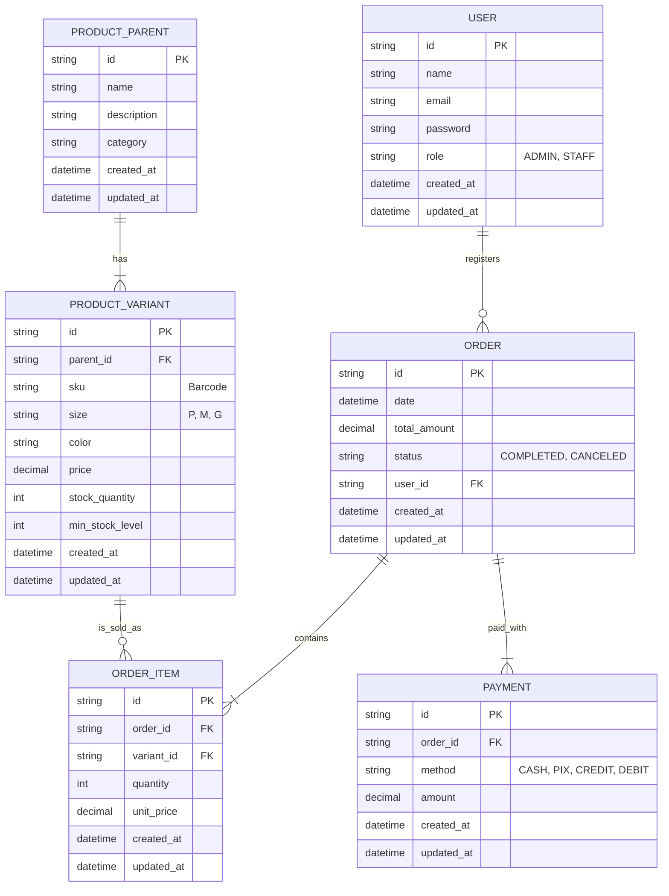
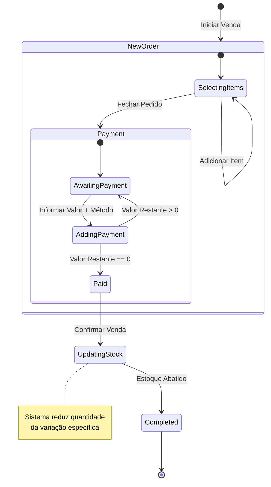

# 📋 Documento de Requisitos de Software: SellTrack PDV (Revisado)

**Versão:** 1.1  
**Data:** 26/12/2025  
**Status:** Validado para Desenvolvimento (ajustado conforme decisões técnicas)

---

## 1. 🚩 Problema e Justificativa

### Problema Identificado

- Processos manuais excessivos e inseguros (inventário e vendas).
- Suspeita de perdas financeiras por falta de controle.

### Justificativa

- Melhorar qualidade de vida da proprietária.
- Reduzir perdas financeiras e aumentar confiabilidade.

---

## 2. 🎯 Objetivos do Projeto

| Objetivo                  | Métrica de Sucesso                                                   |
| :------------------------ | :------------------------------------------------------------------- |
| **Agilidade Operacional** | Reduzir fechamento de caixa/inventário de ~1h para **5-10 minutos**. |
| **Digitalização Total**   | Eliminar **100% dos registros em papel**.                            |
| **Confiabilidade**        | Reduzir divergências de estoque para próximo de zero.                |

---

## 3. ⚖️ Escopo do MVP (Fase 1)

### ✅ Incluído

- Plataforma Web (navegador).
- Gestão de Produtos (Pai/Filho, variações).
- PDV com registro rápido de vendas.
- Pagamentos mistos (Split Payment).
- Backup automático na nuvem (PostgreSQL/Supabase).
- Exportação de dados para `.csv` (Excel `.xlsx` em fase posterior).
- Gestão de Estoque com baixa automática e alertas visuais.

### ❌ Excluído

- Emissão de Nota Fiscal.
- Modo Offline.
- App Mobile nativo.
- Integração TEF com maquininha.
- Trocas automatizadas.

---

## 4. ⚙️ Requisitos Funcionais

### RF01 - Gestão de Produtos

- Cadastro hierárquico (Pai/Filho).
- Campos obrigatórios: Nome, SKU, Tamanho, Cor, Preço, Estoque Mínimo.

### RF02 - Ponto de Venda

- Busca por Nome ou SKU.
- Carrinho de venda com múltiplos itens.
- Total em tempo real.

### RF03 - Pagamentos (Split)

- Suporte a múltiplas formas de pagamento (Dinheiro, Pix, Crédito, Débito).
- Fluxo crítico a ser testado desde o MVP.

### RF04 - Gestão de Estoque

- Abater estoque da variação específica imediatamente.
- Exibir alerta visual em estoque mínimo.

### RF05 - Relatórios e Exportação

- Resumo diário: total vendido + detalhamento por meio de pagamento.
- Exportação inicial em `.csv`.
- Exportação em `.xlsx` será assíncrona para grandes volumes.

---

## 5. 🛡️ Requisitos Não Funcionais

- **RNF01 - Backup em Nuvem:** Banco PostgreSQL (Supabase managed).
- **RNF02 - Disponibilidade:** Sistema web online, exige internet constante.
- **RNF03 - Usabilidade:** Interface otimizada para poucos cliques, busca rápida por SKU.

---

## 6. 🏗️ Modelagem de Dados

### **Diagrama Entidade-Relacionamento (ERD)**

## 7. 🔄 Fluxo de Estados (Venda)

## 8. ✅ Critérios de Aceitação

1. **Venda com Split Payment**: sistema deve calcular corretamente valores restantes.
   - **Dado que** o total da venda é R$ 100,00
   - **Quando** o usuário lançar R$ 30,00 em Dinheiro
   - **Entao** o sistema deve mostrar "Restante: R$ 70,00" e permitir selecionar Cartão para finalizar.
2. **Estoque Mínimo**: alerta visual quando atingir limite.
   - **Dado que** a "Camisa Azul P" tem estoque mínimo de 2 unidades e saldo atual de 2
   - **Quando** uma venda consumir 1 unidade
   - **Entao** o sistema deve sinalizar visualmente (ex: ícone ou cor) que aquele item está com estoque baixo/crítico.
3. **Exportação**: exportar `.csv` em até 5s para volumes médios; `.xlsx` assíncrono para grandes volumes.
   - **Dado que** o usuário clica em "Exportar Relatório"
   - **Entao** o download de um arquivo Excel deve iniciar em menos de 5 segundos, contendo todas as vendas do período selecionado.
